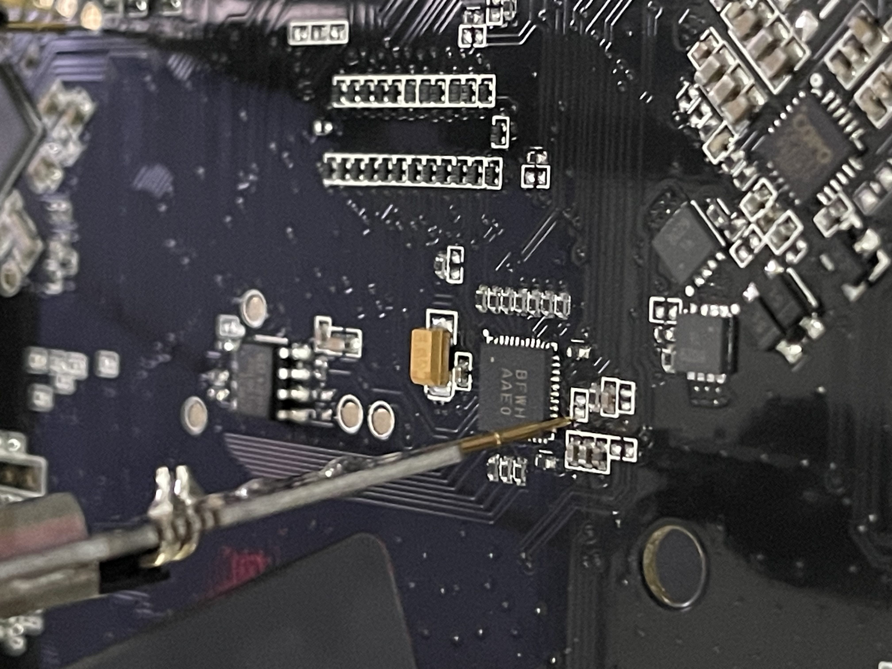
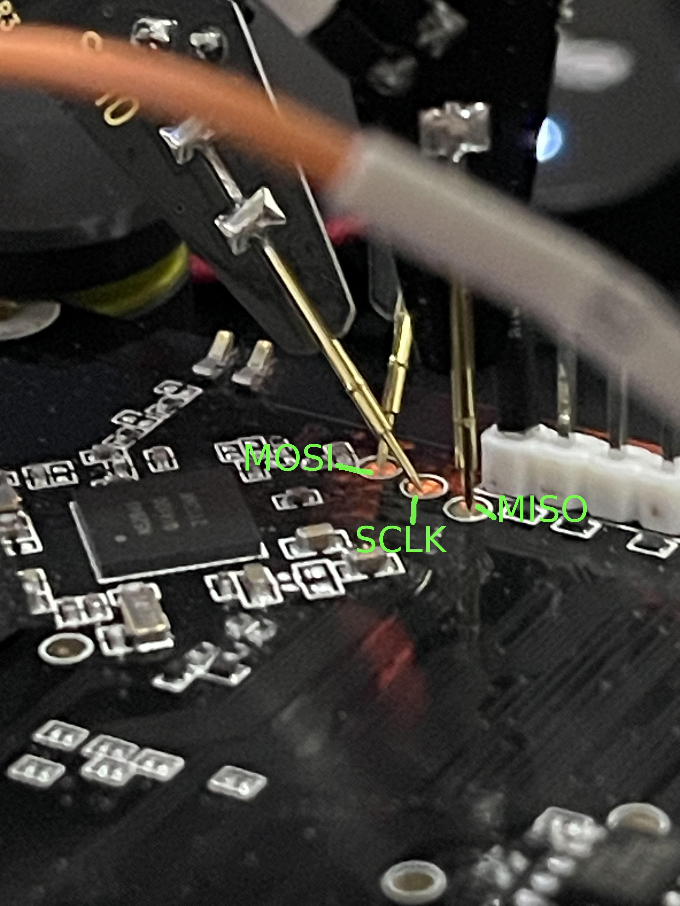

Pinout for SPI control:
## Chip Select

Same for both sides: 
    P0.24 - MOSI
    P0.20 - SCLK
    P0.23 - MISO
    P1.03 - CS
    P1.08 - EN

Underglow LED numbers:
36, 37, 38, 39, 40, 41, 42, 46, 54, 55, 56, 57, 58, 59, 60, 64, 72, 73, 74, 75, 76, 77, 78, 82, 92, 93

RGB LED 1 numbers:
15, 16, 17

RGB LED 2 numbers:
123, 124, 125

RGB LED 3 numbers:
159, 160, 161

RGB LED 4 numbers:
195, 196, 197
