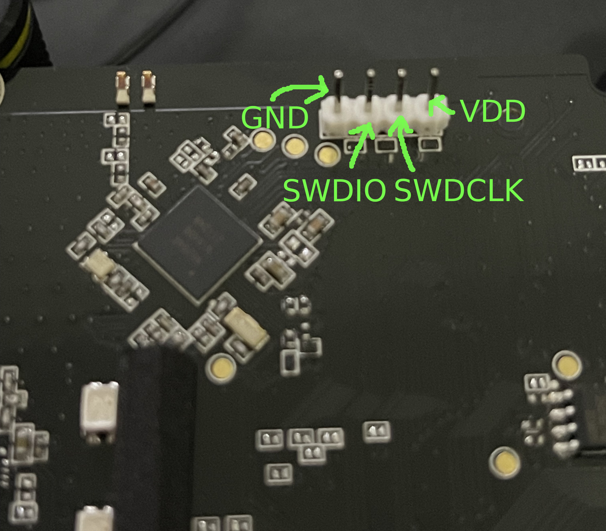

# SWD Pinout:
 0    1     2     3
GND SWDIO SWDCLK VDD

The 52840 implementation features:
- HFCLK
- LFCLK
- DC/DC converter

# Diodes are connected in row -> column configuration

# Left/Right GPIO
Column:
- 0.29
- 0.28
- 0.02
- 0.03

Row:
- 1.15
- 1.14
- 1.13
- 1.12
- 1.11
- 1.10
- 0.31
- 0.30
